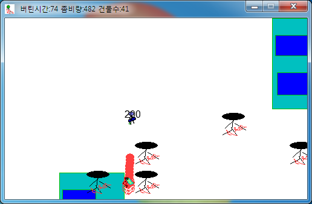

# 미친좀비막기

몰려오는 좀비 떼로부터 건물을 지키는 디펜스 게임이다. 마린과 탱크 중에 유닛을 고르고 마우스만으로 조작한다.

  

## 플레이 방법

Releases에서 받아 실행하면 된다.

시작하면 마린과 탱크 중에 유닛을 고른다. 우클릭으로 이동하고 좌클릭으로 공격한다. 건물은 플레이어의 총알과 포탄에도 부서지므로 쏠 때 조심해야 한다. 좀비에 닿으면 체력이 깎이고 체력이 다 떨어지면 게임이 끝난다.

버틴 시간과 좀비 수, 남은 건물 수는 창 제목표시줄에 나온다. 기록은 하이스코어 표에 남고, 시작 화면의 버튼으로 지울 수 있다.

## 구현 원리

남은 건물 수는 게임메이커에 내장된 `health` 값으로 셌다. 건물이 생길 때 +1, 부서질 때 -1을 하고 그 값을 제목표시줄에 건물 수로 표시한다. 원래 체력용 변수를 카운터로 사용한 것이다.

공격 쿨다운은 알람으로 만들었다. 클릭할 때 알람을 걸고 알람이 울릴 때 탄을 만든다. 버틴 시간과 좀비 수, 건물 수는 창 제목표시줄에 매 프레임 다시 써넣어 표시했다.

## 파일

| 경로 | 내용 |
|---|---|
| `source/crazy-zombie-defense.gmk` | 원본 프로젝트 파일 |
| `source/split/` | GmkSplitter로 분해한 텍스트 트리 |
| `docs/screenshots/` | 스크린샷 |
| Releases | 배포용 파일 |

## 라이선스

CC BY-NC-ND 4.0 라이선스다. 출처를 밝히면 비상업 용도로 그대로 공유할 수 있고, 수정본 배포와 상업적 이용은 금지한다. 함께 들어 있는 것 중 다른 사람이 만든 라이브러리와 그림·소리·맵은 각자의 권리를 따른다. 자세한 내용은 [LICENSE](LICENSE) 에 있다.
